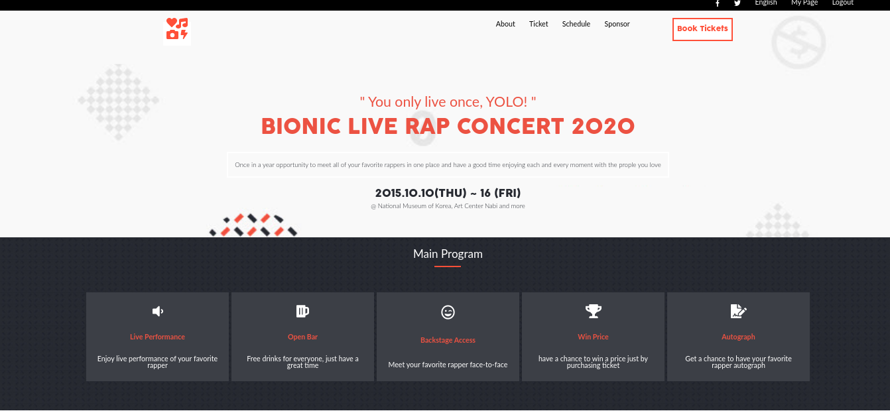
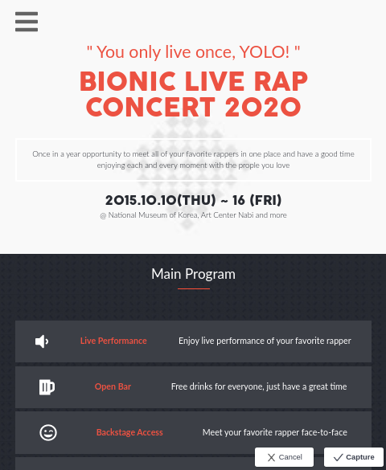

# Bionic Live Rap Concert Website

##[HTML & CSS Capstone]

this website was created for my HTML & CSS capstone Microverse project. in this project i have create concert website with all it's responsive features to support mobile, tablet and desktop view using CSS media queries. the website provides feature to it's users such as :

- purchase ticket
- view general information about the event.
- view schedule
- view guest of the concert
- view sponsors

the website pages are categoriezed into 4 sections

- home page
- about page
- ticket purchasing page
- event schedule page

### Home Page Desktop View

### Home page Mobile View

# Preview Video

[Preview Video Link](https://www.loom.com/share/61b110695db64ad7af6e77b85c09c7fb)

## Built With

- HTML
- SCSS

## Live Demo

[Live Demo Link](https://mikearaya.github.io/bionic_concert)

## Getting Started

To get a local copy up and running follow these simple example steps.

- Clone or download this repository to your local workstation.

### Prerequisites

there are no prerequisits to run the project. but if you want to work on it make sure you have the following installed in your global evnviroment

- [npm](https://www.npmjs.com/products/teams?utm_source=adwords&utm_medium=ppc&utm_campaign=npmTeams2019Q2&utm_content=site&gclid=Cj0KCQjwyPbzBRDsARIsAFh15JaJyPdeb-Q11Rq-LMaulSWINd6PYdJQ2OkZyE75reyBcpnnmwPrgRoaAv_5EALw_wcB)
- [npx](https://www.npmjs.com/package/npx)

### Install

for development make sure you run the following command before you start working on the project
`npm install`
this will install all the packages used for development purpose, mainly `stylint`, `preetier`, `html-validator`, `husky`, &`lint-staged` that will be used for development purpose.

### Usage

enter the directory where you cloned or downloaded the project and open index.html file using your favorite browser

## Authors

👤 **Mikael Araya**

- Github: [@mikearaya](https://github.com/mikearaya)
- Twitter: [@mikearaya12](https://twitter.com/mikearaya12)
- Linkedin: [linkedin](https://linkedin.com/in/mikael-araya)

## 🤝 Contributing

Contributions, issues and feature requests are welcome!

Feel free to check the [issues page](issues/).

## Future Plan

in the future i have a plan to incorporate javascript to make some of the sections more interactive such as:

- mobile side bar is not hidding automatically when a link is selected
- top navigation reponse to scroll event

## Show your support

Give a ⭐️ if you like this project!

## 📝 License

This project is [MIT](lic.url) licensed.

## Acknowledgment

majority of the website was based on the designed from [Cindy Shin in Behance](https://www.behance.net/adagio07)
which you can find at [behance](https://www.behance.net/gallery/29845175/CC-Global-Summit-2015). and i would like to thank
[Cindy Shin in Behance](https://www.behance.net/adagio07) for letting me use this awesome design.
